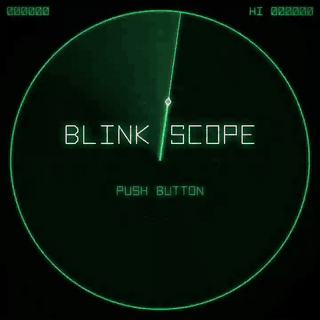

# BLINK SCOPE

**[Play in your browser](https://abagames.github.io/agentic-gamedev-games/blink-scope/)**



Video with sound: [`media/blink-scope-play.mp4`](media/blink-scope-play.mp4) (25 s, 720×720; the attract screen is silent by design, and sound starts with the game).

A one-button vector-radar arcade game. A phosphor sweep turns around your ship; pressing the button makes you **blink to the tip of the beam**, a fixed distance away, and **fire a sonar shot onward along the beam** from where you land. The shot destroys the first hunter it reaches, and that hunter's blast can set off the ones around it. Landing on a hunter, or past the edge of the scope, loses your ship. You only see the hunters as fading radar blips.

Intended sensation: *watching the sweep swing round your ship, reading where fading blips have crept, and blinking toward them just as the beam crosses — so your shot bursts the swarm that nearly had you.*

## Tags

Drawn with `node tools/pick-tags.mjs` (first draw): **radar**, **teleportation**.

- **radar** shapes both the look and the rules. The sweep is both the only way you see hunters and your aim. Hunters exist on screen only as blips painted when the beam crosses them. The blips fade, and each hunter's recent blips are joined into a track, so you have to predict where it is now.
- **teleportation** is the only action. A blink has no travel time and always shoots forward, so the same press can attack (blink toward a far hunter and shoot it), escape (leave the ones closing in) or set up a later shot (blink away so a hunter ends up in shooting range behind you). Which it is depends on when you press.

## Full game premise

You're a lone interceptor inside a deep-space radar net. Each sector sends in hunter swarms that you can only see through your own scope. The full game would run through sectors that change the sweep: hunters that blink on their own (so their blips go stale), decoy echoes, sweeps that change speed or reverse, rescue pods your shot must not hit, and later on a second scope centre. It would be structured as an arcade run for score, with sector bonuses, extra ships and a high-score table.

## The slice

It covers one arcade loop: title/attract (with a demo pilot) → SECTOR n → play → SECTOR CLEAR → the next sector with more pressure → … → **clearing SECTOR 10 completes the game** (ALL SECTORS CLEAR), or GAME OVER → restart. There's one hunter type, one sweep speed and one blink distance.

What it's meant to test: **can a single fixed-distance blink-and-shoot, timed against a rotating sweep and stale radar information, carry both attack and escape decisions and make it satisfying to chain a swarm?**

## Controls

One button: **any ordinary key** (letters, digits, Space, Enter, arrows, …) or a click/tap **anywhere on the screen**, including the bands around the square scope on a phone.

- Not the button: modifier keys on their own, anything pressed with Ctrl / Alt / Cmd (so browser shortcuts never blink you), Tab, Escape, F1–F12, media and system keys, IME composition, key auto-repeat, and right-clicks.
- Presses closer together than 50 ms, from any source, count as one. A rolled pair of keys or a two-finger tap can't fire two blinks; no one aims twice within 50 ms anyway.

- Title: start.
- In play: blink to the white diamond (the tip of the beam) and fire along the beam.
- During READY (SECTOR n shown, after a sector clear or a lost ship): a press starts the sector at once and is an ordinary blink and shot. Hunters are frozen and the time bonus doesn't drain during READY, so there are no free moves.
- Game over / all clear: start again (after a short lockout). After a game over the tube powers back on into SECTOR 1.

## Rules

- The sweep turns clockwise once every 1.5 s in sector 1 (faster later; see Difficulty), centred on your ship. The diamond on the beam marks the landing point, always 110 units away. The dotted ring shows every point you could land on.
- **Shot:** every blink that lands safely fires a wavefront from the landing point along the beam at 900 units/s × game speed, up to 260 units. The wavefront is 20 units wide on each side at the start and widens by 0.14 per unit travelled, so the timing window is about the same at any range (±45 ms at game speed 1, ±38 ms in sector 1). It stops at the first hunter inside it. That hunter bursts 70 ms later and destroys every hunter within 40 units, which can chain. Hunters the blink passes over are not hit.
- **Sonar reveal:** the wavefront also paints any hunter it passes within 45 units beyond its hit band, the same way the sweep paints a blip. A miss still tells you something (the faint green flanks on the wavefront show that band). It stops revealing where it hits.
- **Scoring:** chain link *n* scores 100·n² (100, 400, 900, 1600 …, capped at link 7 = 4900 per kill). You get extra ships at 10,000 points and then every 20,000 (30,000, 50,000 …). Presses and survival time earn nothing.
- **Time bonus:** each sector starts with a bonus of 250 × quota (2500 in sector 1). It drains linearly to 0 over a par of 16 s × quota ÷ game speed, shortened by 4.5% per sector after the first because later sectors clear faster per hunter (133 s in sector 1, 226 s in sector 10), counting only time in play, never READY or losing a ship. An empty bar only means no bonus: it never costs a ship. It is shown as a thin arc outside the quota ticks, draining back toward 12 o'clock. **Every chain link beyond the first gives back 2 s** (the arc flashes white). On clear, the arc drains into the score as a TIME BONUS count-up.
- **Losing a ship:** a hunter touches you, you **land within 11 units of a hunter**, the same hitbox as ordinary contact (landing on one is a crash, never a kill), or you blink with the diamond outside the scope (it turns red with an ✕ when that would happen).
- **Goal:** clear 10 sectors. After sector 10's clear and time-bonus tally, the game ends with ALL SECTORS CLEAR: the ship stands down, the score, HI / NEW HI and PUSH BUTTON are shown on the quiet scope, a fanfare plays, and the high score is saved.
- **Hunters** come in from the scope edge and home in on you with a limited turning rate. A sector ends when its quota is destroyed (the ticks around the bezel). The spawner keeps running until then, so waiting never eases the pressure.
- Blips closer than 134 units (the blink distance + 24) turn red. You can't shoot them, because the blink would land on or past them. You can only get away from them.
- A dotted cone ahead of the diamond shows exactly where a shot fired now would sweep.
- **Close range:** a hunter within 28 units of the ship (contact is 11) shows as a bare, dim red dot without being painted. That gives roughly 0.3–0.5 s of warning, well inside the 70–100 range where escape decisions are made, so the radar stays the real source of information.

## The main decision

On top of each press, there is a pacing decision: **clear fast for the time bonus, or let hunters bunch up for a chain.** A chain pays more per kill and also refills the bar, but waiting drains the bar and lets more hunters close in.

Every moment, the question is **whether to press now, and what for**:

- **Attack:** a green blip lies where the beam will cross → press just before the beam gets there. The cost: every shot also carries you 110 units toward the target and toward the edge.
- **Escape:** a red blip is closing in → press now, as long as the diamond is inside the scope and away from hunters, even with nothing to shoot.
- **Hold:** the diamond points off the scope, or onto a hunter → wait, even though a hunter is close.
- **Setup (the expert pattern):** get away *early*, while a hunter is still 70–100 units off and roughly behind the beam. It ends up about 200 units behind you, and half a revolution later the beam comes round while it is still in shooting range, so the escape turns into the next kill. The trap: if you wait until it's very close, it's only about 114 units away when the beam returns, right at your landing point. Shooting it then means crashing into it. Hunters homing on you bunch up, and one shot into a bunch is a chain.

Why simple patterns lose (measured by `tests/balance.sim.mjs`, 40 seeds, 900 s cap, 3 ships; runs end at game over or at the SECTOR 10 clear):

| policy | mean score | mean survival | note |
|---|---|---|---|
| idle | 0 | 35 s | hunters make contact |
| spam every frame | 0 | 5 s | random walk off the scope (all edge deaths) |
| random ~2 presses/s | 385 | 17 s | mostly edge deaths |
| ping-pong (press every half revolution) | 1,616 | 63 s | stays on the scope, but the quota stalls (sector 1.1) |
| **human-like model** (radar-only, 70 ms timing noise ≈ 17° of aim, 0.25 s to notice danger, skips checking the landing area half the time, reads blips ±6 units off, needs half a sweep turn after each blink to re-orient, waits for clusters early in a sector) | **60,337** | 529 s | mean sector 4.3; rarely finishes |
| radar-only model (45 ms noise, always checks the landing area) | 61,842 | 350 s | sector 8.4 |
| true-position model with 45 ms timing noise | 76,143 | 264 s | sector 9.7 |
| frame-perfect aim + escape | 78,729 | 238 s | finishes almost always |

### Scoring: why square chains and a refund

> **Current status (v7): the best pacing depends on skill.** With the v7 tuning (`tests/patience.sim.mjs`, 40 seeds, 300 s cap), the human-like model scores about 1.7–1.9× more by waiting for clusters early in a sector (immediate 15.6k vs wait-while-80% 25.8k vs wait-while-50% 28.9k). The precise bots still do best shooting immediately (true-position 79.9k vs 53.5k; radar-only 64.5k vs 44.4k). So players who can't shoot accurately and fast get pushed toward chains, and players who can are rewarded for speed. (At v6.7, before the human-error model and the v7 tuning, immediate shooting led for every pilot.)
>
> **Decision (v6.8): keep square chains and the current extends.** The designer's reading of human play: shooting everything the moment it becomes visible is itself hard for a person (every bot does it perfectly), so players drift naturally into letting hunters bunch and going for chains. The bots can't show this because none of them finds immediate shooting hard. Tested and not adopted: a larger bar refund per chain link (4–8 s changed nothing, because the real cost of waiting is survival, not time), and cubic chain scoring (restored the shoot/wait trade-off for bots but inflated scores and extra ships). Supporting data: even the human-like pilot that shoots immediately earns **57% of its kill points from chain links**, although those are only 16% of its kills, because square scoring makes the chains it stumbles into count heavily. Worsening its aim (up to 25° of extra stray) raises that share only slightly (to 64%) and never makes deliberate waiting win. A further human limit reproduces the drift directly. After a blink the beam's pivot has jumped, so a person needs **half a turn or more to re-orient** before aiming again; accurate rapid consecutive blinks are very hard. Modelling that re-orientation time shrinks immediate shooting's lead (human-like pilot: 20.7k vs wait-early 15.8k with no settle time, 16.4k vs 13.3k at half a turn) and reverses it at 0.75 turns (9.3k vs 10.1k), while the share of immediate play's points that come from chains rises from 48% to 56–63%. The human-like model now uses half a turn. Whether real players do pace themselves toward chains is still the key thing to check in a human playtest.
>
> The table below records the v6 evidence that led to the current scoring.

The first proposal was gentle linear chains (100, 200, 300 …) plus a time bonus. It was tested against pilots that differ only in patience: *immediate* fires at anything, *adaptive* fires only into clusters while the bar is above 50% / 25%, and *patient* always waits for clusters. Mean score over 60 seeds:

| scoring | true-position pilots: imm / ad50 / ad25 / patient | radar-only pilots: imm / ad50 / ad25 / patient |
|---|---|---|
| linear, no refund | **28.4k** / 14.0k / 11.9k / 9.7k | **11.1k** / 7.5k / 6.8k / 6.6k |
| doubling, no refund (v5 scoring + bonus) | **28.9k** / 18.9k / 15.8k / 14.6k | **13.6k** / 7.9k / 8.4k / 7.9k |
| steep linear 100+300(n−1), refund 2 s | 34.3k / **35.1k** / 24.9k / 25.8k | **14.1k** / 10.9k / 10.2k / 11.6k |
| **square, refund 2 s (current)** | 34.8k / **49.1k** / 35.2k / 35.9k | **14.4k** / 13.3k / 11.8k / 14.2k |

With linear or doubling chains, *shoot now* dominates by 1.5–3×: a 3-chain earns +300 over singles, while waiting 3 s costs about 375 of bonus. At the time of v6, only square chains with a refund made the best play depend on the situation. For true-position pilots the adaptive player wins clearly; for radar-only pilots the strategies are within about 10% of each other, so none dominates. The refund also ties the two systems together: a chain is both score and time. Linear scoring remains available (`CFG.chainScore = "linear"`, `chainRefund = 0`), and `node tests/patience.sim.mjs 60 linear 0` reproduces its row.

Difficulty is **game speed**. The speed factor k starts at 1.2 in sector 1 (sweep 1.5 s). Each sector raises it by 7% of that base, up to 1.3× the base from sector 6 on (sweep 1.15 s). k speeds up everything that moves together: the sweep, the hunters' speed and turning, spawns, the shot, and how fast blips fade. Distances (scope, blink, shot width, burst) stay fixed. So the spatial rules of thumb stay true in every sector, such as how far a hunter closes in half a turn, when to escape early, and where the too-close trap sits. The only thing that shrinks is the time you have: the timing window goes from ±38 ms to ±29 ms. On top of that the quota grows by 3 per sector (10 in sector 1, 37 in sector 10), and live hunters go from 5 to 8.

| sector | k | sweep period | timing window | hunter speed | quota | live | bar lasts |
|---|---|---|---|---|---|---|---|
| 1 | 1.20 | 1.50 s | ±38 ms | 31 | 10 | 5 | 133 s |
| 3 | 1.37 | 1.32 s | ±33 ms | 36 | 16 | 7 | 170 s |
| 5 | 1.54 | 1.17 s | ±29 ms | 40 | 22 | 8 | 188 s |
| 6–10 | 1.56 | 1.15 s | ±29 ms | 41 | 25–37 | 8 | 199–226 s |

Why all at once: in a simulation with the sector fixed, speeding up only the hunters dropped a zero-noise bot's hit rate from 43% to 30% at k = 1.45, because the rules of thumb drifted. Scaling everything kept it at 43–48% while kills per minute rose. An earlier trial that sped up only the sweep failed in the same way.

## Design and interaction language

The look is a monochrome P7-phosphor vector scope: green on near-black, glowing strokes, afterglow behind the beam, range rings and a faint raster. All text uses a custom stroke font drawn as vector lines. Colours each have one job:

- green: world and information,
- white: you, your landing point and rewards,
- red: danger (contacts inside the ring, a landing off the scope, losing a ship).

Feedback, weakest to strongest:

- Sweep metronome: a dry click every 1/8 turn, accented at 12 o'clock. You can hear the beam's rhythm to anticipate the press, and it speeds up with game speed.
- Sweep contact: a short, soft blip on every sweep paint. Its pitch rises the closer the hunter is. It is kept short because it fires often, with only a light reverb send.
- The ping is harsher for a contact too close to shoot.
- Blink: a zap, a streak, an afterimage ring where you left and an arrival ring.
- Shot: an **active-sonar ping**, a clear 1.48 kHz tone with a long hull-reverb tail (a damped feedback delay), and a white wavefront arc drawn at its true hit width.
- **Echoes:** each hunter the wavefront reveals sends back a short *pong* after a further delay equal to the ping's travel time to it, so later means farther. Its pitch is Doppler-shifted by the hunter's closing speed: higher when it's approaching, lower when it's going away (±15% max). You can hear the range and the direction of motion without looking. A missed shot fades out with a small green ring.
- Kill: a **noisy blast**. It is mostly distorted noise: a bright crack, a crunch, a scatter of debris crackles over about 0.4 s, a long rumble, and only a short sub push with no audible pitch. Chain links get brighter rather than higher, so the blast never reads as a drum. Visually: a burst ring that grows to exactly the chain radius, point popups, a brief freeze scaled to the chain, and pitch rising with each link.
- Each kill also sends a spark to its quota tick on the bezel. The tick stays lit until the spark lands, then flashes and goes out with a relay click. This links the kill to the sector's progress without any text.
- Kills deflect the whole picture sideways briefly, like a vector monitor's X coil, in proportion to the chain. A chain of 3 or more **overloads the graticule**: the range rings, crosshair and bezel bloom green. This replaces a flat screen flash.
- Losing a ship: the hunter responsible is revealed at its true position as a small red ring, with a dashed tail back along its heading, until the next READY. The graticule overloads red, the raster tears (horizontal bands slip for half a second), wreckage spreads and a falling noise sweep plays.
- Game over: the picture collapses to a line, then a dot, like a tube switching off, with a power-down whine. The tube stays off afterwards. Only GAME OVER, the final score, the HI score (with a flashing NEW HI on a record) and PUSH BUTTON are lit, over a ghost of the bezel that fades out. Pressing, or the 12 s return to the title, switches the tube back on: a dot, a line, then the picture opens, with a rising whine.

Sector clear and extra ships have their own jingles.

## Revision history

- v7.8.1 (current): the play video no longer opens on a white frame. The recording starts on the browser's white blank page, and the trim point came from Node-side timing that could land one frame early. It is now taken from the video itself (the first frame the dark game has drawn). Verified: first-frame brightness 235 → 30, and sound still starts at the game-start frame.
- v7.8: **a destroyed hunter's radar track goes out.** Blips used to fade only with age (about 2.7 s), so after a chain the destroyed cluster's blips were still on the scope when SECTOR CLEAR appeared. The chain had also hit the hunters at their true positions, 35–45 units from their stale blips, so the clear looked as if it came before they were destroyed (seen in the play video). Now every blip of a destroyed hunter flashes and vanishes within 0.25 s (`trackOut`), and its track line disappears at once, so a kill visibly removes its contact. The video was re-recorded: the chain's blips go out, the last contact is shot, and then SECTOR CLEAR appears.
- v7.7.1: fixed the video's audio sync. v7.7 placed the audio with a start-time offset (an MP4 edit list), which many players ignore, so the game's sound played from the start of the title screen. The audio track now starts at 0 with real leading silence up to the detected game-start frame. Verified by decoding from 0: silence until the game starts, and frames on either side of that time show the title, then SECTOR 1.
- v7.7: the video has sound. The game's WebAudio mix is captured in the page (a MediaStream tap after the limiter, recorded by MediaRecorder) starting in the same call that starts the game. It is placed at the video frame where the title text disappears, then muxed as AAC. A cross-correlation of kill sounds against frame brightness scatters within ±~100–200 ms, and its aggregate (picture +100 ms) is biased by burst rings that keep growing after the sound, so sync is by construction (±1–2 frames) and has not been measured more finely.
- v7.6: a play video (`media/`, recorded by `tools/record-video.mjs`). It shows 5 s of title/attract, then about 20 s of sector 1 flown by the demo pilot, using the game/pilot seed pair 47/332 found in the simulator. That run replays identically in the browser: 10 kills, a 4-chain, and a sector clear with its time-bonus tally. Also fixed: the spare-ship icons showed one extra ship during SECTOR CLEAR and game complete.
- v7.5: you start with **3 ships** again (from 4), with extends unchanged (10k, then every 20k); the designer's call after the v7.4 re-check. Measured with the v7.4 gauge: human-like mean sector 5.1 → 4.3 and a clear rate of 3% → about 0%; radar-only clears 50% → 25%; true-position 82% → 65%. Ping-pong stays about 1.6k. Pacing still depends on skill (`tests/patience.sim.mjs`): human-like 11.5k immediate vs 26.3k waiting early; the precise bots still do best immediate.
- v7.4: balance re-check.
  - **Gauge:** later sectors clear faster per hunter (radar-only 3.9 → 2.3 play-seconds per hunter × k), so late sectors used to pay almost the full bonus (human-like: 50% of the bar left in S1–3 vs 71% in S7–10; radar-only 77% vs 86%). The bar now shortens by 4.5% per sector (`parDecay`): human-like 53% / 60%, radar-only 77% / 79%.
  - **Ships:** kept at 4. Skilled pilots reach the last sector with a full stock because extends replace losses (4–6 per run), but every way of trimming (3 ships, or extends at 20k/+40k) mostly hurts weaker players. The human-like model's clear rate falls from 3–5% to 0–2% and its mean sector from 5.1 to about 4.2, which is below the difficulty target set in v7. Left for the designer's play judgement.
- v7.3: any ordinary key is the button (before, only Space / Enter / Z / X), with modifiers, shortcuts and system keys excluded. Presses within 50 ms merge into one.
- v7.2: mobile. The whole screen is the button (before, only the square canvas was, so the bands above and below it on a portrait phone, 40–50% of the screen, ignored taps). The long-press callout, tap highlight and context menu are suppressed. The scope is sized inside the safe-area insets (`viewport-fit=cover`).
- v7.1: the **attract-mode pilot** now acts only on what the scope shows (paints and close-range dots), with human pacing (half-turn re-orientation after each blink, 50 ms timing error) but no attention lapses. Before, it read true hunter positions, so it acted on things the viewer couldn't see. Demo conditions (1 ship, 40 s, 100 seeds): it survives 85%, gets its first kill in about 4 s and shows a chain in 73% of demos. A wiring bug found while doing this: `main.js` didn't pass step events to the pilot, which blinded the radar-only pilot in the real page (0 kills in 25 s). The simulator hides this because it passes events itself, so a probe now requires the real attract demo to score a kill.
- v7: **difficulty retuned for human play.**
  - First, a bot artifact was fixed. The human-like model extrapolated remembered blips toward the ship for up to 4 s, so stale blips "arrived" on the ship and it panic-blinked about once every 0.8 s; three quarters of its deaths followed those blinks. Now blips are forgotten after 1.5 turns, extrapolated at most one turn, and escapes also wait for re-orientation.
  - Then, against that model: **hunter speed 36 → 26** (the strongest lever by far) and **shorter sectors** (quota 12 + 4/sector → 10 + 3/sector). Human-like: mean sector 3.3 → about 5, finishing 0% → 8%. Radar-only: finishing 38% → 63%. Ping-pong stays near 2k.
  - The time bar was refit to measured human-like clear times (a median of 6.3 play-seconds per hunter): par 10 → 16 s per hunter, so a median clear keeps about 60% of the bar and a slow one (75th percentile) about 20%.
  - Pacing now depends on skill. The human-like model scores about 1.7–1.9× more by waiting for clusters early (15.6k immediate vs 25.8–28.9k waiting). Precise bots still do best shooting immediately. This matches the designer's reading that people drift into chain play.
  - Tuning knobs moved into `CFG`: `hunterSpeed`, `quotaBase`, `quotaStep`, `liveBase`, `liveMax`.
- v6.9: the human-like model gains a **re-orientation time** of half a sweep turn after each blink before it can aim again (designer's observation of human play). With it, the model is weaker (sector about 2.7, never completes the game) and deliberate early waiting catches up with or overtakes immediate shooting (see Scoring).
- v6.8: scoring left unchanged by decision (see Scoring, Current status). The game is also now **finite**. Clearing SECTOR 10 completes it (a new `complete` phase with its own screen and fanfare). With the current tuning (60 seeds, 20 min cap), the human-like model never finishes (mean sector 3.0), the radar-only model finishes 18% of runs and the true-position model 37%, each in a median of about 10 minutes.
- v6.7: **one hitbox**. The separate landing-crash radius (16) was removed, so landing uses the ordinary contact radius (11). Human-like model: sector 2.2 → 3.0, survival 110 s → 166 s. Blind half-turn rhythm stays at about 1k. Side effect: shoot-now now leads the pacing comparison for every pilot type (see Scoring).
- v6.6: a **human-like pilot** was added to the simulator, because the earlier bots always checked the landing area and never made the typical human mistake of blinking right next to a hunter. It is much weaker (sector 2.2 vs 5.2), and nearly all its deaths are that mistake. The gauge was retuned against it: par 6 → 10 s per hunter, which leaves a median ~60% of the bar at a sector-1–3 clear (it was 43%). A proposed rule, **shot fired from the blink origin** (sweeping the jump path before landing), was tested and rejected. It did fix the mistake (human-like: sector 2.2 → 4.5), but because hunters converge on the ship, blind rhythm pressing then scored 81k, 2.7× the human-like pilot. It remains as `CFG.shotFrom = "origin"`, off by default.
- v6.5: pressing during READY starts play immediately with that blink, instead of being ignored.
- v6.4: the bar drains at half the speed (par 3.0 → 6.0 s per hunter). The pacing balance survives, with a shorter window worth waiting: with `tests/patience.sim.mjs` (300 s cap), a pilot that waits for clusters only while the bar is above 80% (about the first 12 s of a sector) scores 69.7k vs immediate 65.1k with true positions, and 27.6k vs 27.5k radar-only. Waiting longer (50%, 25%, always) now loses.
- v6.3: you now start with 4 ships instead of 3, to ease the difficulty. Of the levers tried, speed changes did almost nothing, and a smaller landing-crash radius made shoot-now dominant; an extra ship eased the game without breaking the pacing balance. Radar-only adaptive pilot: survival 167 s → 205 s, sector 3.8 → 4.5 (600 s cap). `tests/patience.sim.mjs` (300 s cap): radar-only adaptive 22.9k vs immediate 21.9k vs patient 18.5k; true-position immediate 51.0k ≈ adaptive 50.5k, patient 36.9k.
- v6.2: the extend schedule went from every 15,000 to 10,000, then every 20,000. More players reach the first extra ship (radar-only pilots 47% → 62% of runs), and late extends are rarer (strong pilots 2.8 → 2.4 per run). Overall difficulty is almost unchanged (survival 165 s → 167 s).
- v6.1: the bar drains 25% slower (par 2.4 → 3.0 s per hunter). With `tests/patience.sim.mjs`, an adaptive pilot is now best for both pilot types: true-position 41.4k vs immediate 39.5k, patient 27.3k; radar-only 18.5k vs immediate 16.5k, patient 13.7k.
- v6: the time bonus (a bezel arc, drained only in play, refilled 2 s per extra chain link, tallied on clear) replaces the fixed 1000 × sector bonus. Chain scoring became 100·n² capped at link 7. The requested linear scoring was tested and made shoot-now dominant (see Scoring).
- v5.5: the kill sound was rebuilt from noise because the tonal version sounded like a drum. Spectral flatness (0 = pure tone, 1 = white noise) went from 0.006 to 0.095, while the ping reference is 0.000. Peaks: kill 0.48, and the worst-case stack reaches 0.81.
- v5.4: every dry voice now gets a light reverb send (22%; metronome 12%, sweep blip 30%) so all sounds share the ping's space, and the kill became a heavier underwater blast. The master was lowered to keep headroom. Measured peaks on their own: sweep blip 0.04 < ping 0.09 < kill 0.43, and the worst-case stack reaches 0.87.
- v5.3: a submarine active-sonar sound set. Ping on the shot, range-delayed Doppler echoes from revealed hunters, softer sweep blips, a limiter and a shared reverb bus. Measured peak levels on their own: sweep blip 0.04 < ping 0.10 < kill 0.29, and a worst-case stack reaches 0.68 (no clipping).
- v5.2: a minimal close-range dot (28 units) and a killer reveal on death. Why: of the radar-only model's contact deaths, 95% were landing crashes and 5% were touches (the true-position model: 78% / 22%). Hunters sneaking up unseen were rare. The reveal explains every death at no gameplay cost, the dot covers the touch-after-landing case, and there was no measurable balance change (16.1k → 16.3k). A red landing-point warning was considered and rejected, because it would give away too much and take away from reading the radar.
- v5.1: the game-over screen stays dark after the collapse, and leaving it powers the tube back on.
- v5: the shot's sonar reveal (a rule change). Presentation: a metronome, graticule overload instead of the screen flash, sideways beam deflection instead of screen shake, raster tear on losing a ship, and tube-off collapse on game over. In simulation, the radar-only model went from 10.0k to 16.1k points and from sector 3.4 to 4.3 by using shot reveals. Idle, spam and ping-pong are unchanged.
- v4: the base game speed went up by 1.2× on request (sector-1 sweep 1.8 s → 1.5 s, with every other rate scaled too), and the cap came down from 1.45 to 1.3 of the base so the fastest sweep is 1.15 s. In simulation, a 45 ms-noise bot loses about one sector of reach (4.2 → 3.4), while a 25 ms-noise bot is almost unchanged (5.1 → 5.0).
- v3: escalation became uniform game speed (see Difficulty). Before, only the hunters sped up, with a jump from 36 to 47 between sectors 1 and 2, while the sweep stayed at 1.8 s.
- v1 destroyed hunters by blinking onto them. User review feedback: diving in to destroy was indistinguishable from contact and felt arbitrary. v2: the blink fires a shot forward from the landing point, and landing on a hunter is always a crash. The shot widens with range to keep the timing window near v1's level (a fixed-width bullet gave about ±26 ms at long range, and bot hit rates fell sharply). The danger colour now marks "too close to shoot".

## Deliberately left out

Hunters that blink, decoys, sweep variations, rescue pods, a multi-entry high-score table with initials, attract-mode score table and BGM. The slice keeps a single hunter so the core timing/prediction loop can be judged in isolation.

## Run locally

Open `index.html` directly in a browser (it loads the bundled classic script `game.js`, so it runs from `file://`).

Play-test overrides, for comparing speeds by hand:
- `index.html?speed=1.3` fixes the game speed for the whole run.
- `index.html?sector=5` starts in sector 5 at that sector's speed.
- They can be combined.

Or serve it from the repository root:

```
python3 -m http.server 8000
# open http://localhost:8000/docs/blink-scope/
```

The source files are ES modules (`game-core.js`, `demo-bot.js`, `vector-font.js`, `audio.js`, `main.js`). After editing any of them, rebuild the bundle:

```
node tools/build.mjs
```

## Tests

Run from this directory. Playwright is resolved from the repository root's `node_modules`.

```
node tests/core.test.mjs          # 31 rule checks: blink geometry, landing on a hunter = crash,
                                  # shot band edges / travel time / first-hit stop / range expiry,
                                  # passed-over hunters survive, chain doubling, single scoring per
                                  # hunter, edge/contact loss, paint once per turn, sector quota/clear,
                                  # extra ships at 10k / 30k (none in between), game over, fresh restart, speed curve, per-turn
                                  # invariance of every scaled rate, sweep speed-up on clear,
                                  # ?speed override stays fixed, shot reveal band (paints once,
                                  # never kills, stops at the hit point), death events name the killer,
                                  # time bonus value / drain only in play / chain refund / link cap
node tests/balance.sim.mjs 40 900 # policy comparison table above (900 s cap), incl. humanLike
node tests/patience.sim.mjs 60     # shoot-now vs wait-for-clusters (true / radar / human-like) under the current scoring
node tests/browser.probe.mjs [dir]# 26 real-page probes: title/attract, Space/pointer/Z input, blink,
                                  # shot kill, 4-hunter chain = 1500, danger-colour pixels, landing
                                  # crash, edge loss, game over + hi-score saved, restart, idle loses,
                                  # ?speed / ?sector overrides, kill spark → bezel tick goes dark on arrival,
                                  # 8 metronome clicks per turn, chain bloom never fills the corner,
                                  # game-over collapse line, dark result screen (no scope drawn),
                                  # power-on at restart, close-range dot (20 away drawn, 40 away hidden),
                                  # landing-crash killer revealed, echo delay = range / shot speed with
                                  # Doppler sign by approach, worst-case audio stack peaks below clipping,
                                  # time-bar arc length follows the bonus, clear tally adds kill + bonus.
                                  # Probe presses are made with the sim frozen, so they resolve on an
                                  # exact tick; setup first waits for in-flight bursts/shots so an
                                  # earlier scenario's chain can't leak in.
node tests/capture-play.mjs <dir> # filmstrip of a game flown by the autopilot
node tools/record-video.mjs       # re-record media/blink-scope-play.mp4 (with the game's own audio) and screenshot.gif (needs ffmpeg);
                                  # args: [outDir] [titleSeconds] [playSeconds] [gameSeed] [pilotSeed]
```

The generic smoke test from `web-mini-game-kit` (`smoke-test.mjs index.html`) also passes.

## Known limitations / untested

- No human playtest yet. The timing window (±38 ms in sector 1, ±29 ms at the cap) is judged only by bot models with a fixed 45 ms timing noise. The dials to adjust once people have played it are the base `speedBase`, the cap `speedMax` and the step `speedStep`. `?speed=` fixes k exactly for that comparison: `?speed=1` is the v3 sector-1 pace, `?speed=1.2` is the current one.
- The radar-only bot model extrapolates crudely. Human reading of the tracks is expected to be better, but that hasn't been measured.
- Hit-stop, chain-link delay and the READY/clear pauses are deliberately not scaled with game speed.
- The audio has been checked by measurement only (event wiring, echo timing and Doppler sign, peak levels, no clipping). Nobody has listened to it yet. Whether the ping and echoes actually *sound* like sonar, and whether the metronome sits well in the mix, still needs checking by ear.
- The "escape early" setup pattern follows from the rules (the bots use a 75-unit escape distance). No bot deliberately waits for a cluster, so how much the chain bonus pays for ambitious waiting is untested.
- The high score is a single localStorage value. There's no initials entry.
- Mobile was checked only in emulation (headless Chromium with iPhone 13 portrait/landscape and Pixel 7 profiles): full-screen tap input, no page scroll, the context menu suppressed, and the scope fitting inside injected safe-area insets. Not checked on real devices: iOS audio unlocking on the first tap, frame rate with the glow effects on phone GPUs, touch latency, and real notch insets. Not checked in Safari or Firefox.
- `window.__blink` is left in as a test hook, including `autopilot()`.
