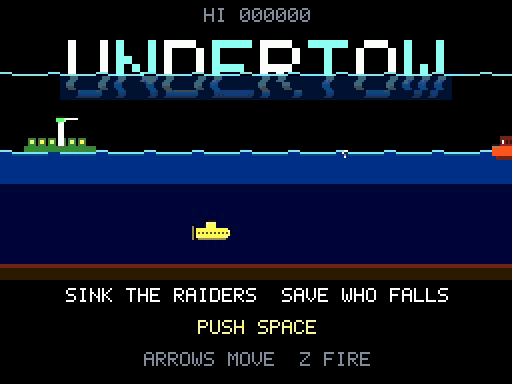

# UNDERTOW

A 1982-style side-scrolling submarine rescue game with a whole-sea radar.

[Play in the browser](https://abagames.github.io/agentic-gamedev-games/undertow/) ·
[gameplay video with sound](media/undertow-play.mp4) (4 s title, then 16 s of wave 1 played by the
lookahead planner)

Each wave opens after a wreck has scattered its survivors, in life jackets, **all round the sea**.
They lie from just off our harbour to 110 px off the raiders' port, some at the surface and some
already sinking slowly through mid-water. When the wave starts, the raiders' port empties at once
and more raiders keep coming.

- **You** catch survivors by touch, at any depth, and carry them to **our harbour** or hand them to
  our ferry. The hold takes 8.
- **Raider grab-ships** sail out empty to just past the farthest survivor on their side. Then they
  trawl back toward their port, lifting people with a crane arm.
- **Raider grab-subs** work the deeper water.
- **A raider carrying people is heavy.** One aboard drops it to 45 % speed, and each more takes
  off another 7 %, down to 25 %. Sink it before it reaches its port and everyone aboard spills
  and **sinks fast**. Catch them before the seabed.
- **Escort destroyers** sail 22 px astern of some grab-ships: 10 % of them at wave 1, rising to
  35 %.
  - When our sub comes within 130 px, the destroyer breaks station and runs at it for 3 s.
  - When our sub is under water within 80 px, the destroyer's stern racks flash for 0.6 s. Then it
    drops three depth charges, 16 px apart, set to the sub's depth. Their blasts also kill anyone
    spilled nearby.
  - Once its raider is sunk, it hunts our sub for 8 s, then goes home.
  - A torpedo sinks it like any hull (+50).
  - Engage from ahead of the raider, or from deep enough to outrange the charges.
- **Patrolling grab-subs** close on our sub when it comes within 150 px, get onto its depth line,
  and fire (after the bow tube flashes).
- **Raider grab-subs** leave their port just under the surface and dive to work. They shadow the
  grab-ships and take anyone who sinks past the arms. Heading home, they rise as they near the
  port, and can enter only near the surface. If our sub keeps survivors aboard once the sea is
  otherwise settled, they hunt it down and ram it. Otherwise hulls just bump apart.

A survivor is saved only at our harbour and lost only at their port. Until then, whoever carries
them can be destroyed:

- **Sink a raider** and everyone in its hold spills out. Without jackets they **sink fast**. Catch
  them before the seabed.
- **Lose your sub** and everyone aboard is thrown out where you died. The next sub starts from
  our harbour.
- **Our ferry** waits out at sea, 150 px from our harbour, on whichever side of the ring you are
  working. Surface under it to hand survivors over (8 seats). It turns for home a second after the
  last hand-over and saves them when it docks. Two shells sink it, and its load spills.

**A wave clears only when every survivor has reached one port or the other.**

## Campaign

**8 waves, then ALL CLEAR.** The HUD shows the wave as "n/8".

| wave | new element |
|---|---|
| 1 | grab-ships only |
| 2 | + grab-subs |
| 3 | + escort destroyers |
| 4 | + deck guns reach 40 px deep (the lighter band widens) |
| 5–7 | more and faster raiders, denser hazards |
| 8 | FINAL WAVE: everything at its peak |

- Every wave starts with the sub and an empty ferry at our harbour.
- **Losing survivors costs subs.** Each one drowned, blasted or carried into their port counts.
  The **3rd since the last miss or wave clear** recalls the sub, which is a miss like being
  sunk. Anyone aboard goes home with it.
  - A miss, or the start of the next wave, resets the count.
  - One mistake costs one sub. These do not count toward the next miss:
    - losses while the sub is down
    - people thrown out of a sub that was sunk
    - people already aboard a raider when the sub was lost, if that raider later reaches its
      port. They show as grey windows on the raider and grey pips on the radar. The clear screen still shows what was
    lost in the wave.
  - At a wave clear, each figure still standing pays 200 × the wave number (FIGURES LEFT).
  - The HUD shows three green figures by the spare subs, one per loss you have left. At each loss
    a red figure flies from the spot (or from its radar blip, if off screen) to the counter and
    crosses one out. The last one blinks. The third loss shows "3 LOST" and the spare subs flash.
- The game is lost when the last sub is gone. An extra sub comes every **30 survivors brought
  home**, not by score.
  - The HUD shows a hollow sub by the spare subs, with a number: how many more to bring home.
  - Whenever people are brought home (unloaded at the harbour, docked by the ferry, or carried
    home by a recalled sub), green figures fly from that spot to it. Each one that lands counts
    the number down and fills the hollow sub. At 0 it flashes full and becomes an extra sub.
- Clearing wave 8 pays 3,000 per sub in hand. Clearing all 8 waves with nobody lost adds 20,000
  and shows "NOBODY LOST".

## Tags

`sink`, `rescue`: the first draw of `node tools/pick-tags.mjs`. Kept, not rerolled.

- **sink:** every survivor is sinking, and the spilled hold of a sunk carrier sinks fast. Your
  torpedo is the reverse: it climbs. Every survivor aboard makes your sub sink a little and move
  slower.
- **rescue:** points, extra subs and survival come from people delivered, not from kills.
  - An empty raider is worth nothing.
  - Catching a raider's whole spilled hold pays n² × 100.

## Controls

| input | action |
|---|---|
| arrows / WASD | move the sub (8 directions, with momentum) |
| Z / X / Space / J | fire a torpedo in the direction the sub faces (one at a time) |
| M | mute |
| touch | drag on the left 60 % to steer; tap the right 40 % to fire |
| gamepad | left stick or D-pad; face buttons fire |

## Core interaction: depth is range

- The torpedo **climbs 1 px for every 2 px it runs**. It hits a hull where it reaches the
  surface, so the deeper you fire from, the farther ahead it strikes.
  - A yellow tick on the surface shows where a shot fired now would reach the hulls.
  - A shot from just under the surface breaks the surface almost at once.
- The torpedo hits a grab-sub where its climbing run crosses that sub's depth.
- **The surface is dangerous.** Grab-ships shell our sub whenever it is within 40 px of the
  surface, which is the lighter band. They also shell a loaded ferry.
  - For 0.7 s the deck gun flashes. In step with it, a crosshair and a half-disc on the surface
    track the sub: that is where the shell will go.
  - When the gun fires, the aim locks. The half-disc turns red and blinks faster as the shell
    comes down over 1.2 s.
  - The shell bursts at the surface, and its blast reaches 22 px into the water. Get out sideways,
    or dive below the half-disc.
- **Right under a grab-ship is dangerous.** A sub 30 px or more below a grab-ship gets a mine,
  after the stern lamp flashes.
- **The main decisions:**
  - where and at what depth to line up each shot
  - when to sink a raider: early for safety, or once it is full for the n² bonus
  - catching jacket survivors yourself vs. hunting raiders
  - carrying survivors home vs. handing them to the ferry

## Design and interaction language

- 256×192 raster at 60 Hz, with a limited palette and a scanline overlay.
- One colour per role:
  - you: yellow
  - raiders: orange (ship) and violet (sub)
  - survivors: white with an orange life jacket; without a jacket after a spill. They turn blue
    as they sink and flash red near the seabed.
  - our harbour and ferry: green
  - mines, shells and hostile torpedoes: red and yellow
- The lighter band under the surface is the deck guns' reach.
- The radar shows the whole ring, scrolled so the main view is always in the middle. Left and
  right on the radar are the same way round the ring as on the main screen, and there is no seam
  near the sub. Shown: our harbour, their port, the ferry, raiders with their loads, every
  survivor, mines and shells.
  When their port is near the radar's edge, it is also marked at the other edge, because raiders
  leave it both ways round.
  every survivor, mines and shells.
- A sonar ping speeds up while anyone is sinking.
- **Our lighthouse** turns a beam over the sky to show the way home. Theirs sweeps the water for
  prey. The beam is brighter while survivors are aboard and flashes as each one is brought home.
- **Their port mirrors our harbour:** the same jetty, block and tower, in red and black. It has a
  barred holding block instead of houses, and a crane with a sweeping searchlight instead of a
  lighthouse. One barred window lights for every person carried in during the wave.
- **Title:** the logo sits half under the surface, its lower part dim and swaying. Below it, a
  looping scene drawn in the game's own style shows the whole loop: a grab-ship lifts a
  survivor, our sub fires a climbing torpedo from depth, the ship breaks, the spill sinks, and
  the sub catches them and brings them home (+200). Text is one line, PUSH SPACE, controls and
  the high score.
- **What kills you is drawn at the size that kills you.** A blast is shown filled at its full
  lethal radius for as long as it is lethal (0.22 s), and only then spreads and fades.
- **A recall is not an explosion.** When losses cost the sub, it blinks white and rises away in
  bubbles with "3 LOST", so it does not look like being sunk by nothing.
- Feel is render-only; collision and simulation are untouched.
  - **Sinking a carrier** is the core moment. The hull flashes white, then breaks. The view is
    pushed along the torpedo's run, and hit-stop grows with the number aboard. Everyone aboard is
    thrown clear in a short arc before they start to sink.
  - **The strongest feedback is reserved for ALL SAVED.** Double light rings from the sub, a radar
    blip, a gold flash and a jingle. A single catch gets only a small glint and a note.
  - **The sub pitches** with its vertical speed (bow up when climbing), narrows briefly as it turns,
    and leaves a bubble wake that scales with speed. With more aboard, the bubbles rise more
    slowly.
- Score numbers sink, like everything else here. They stay in the water, clear of the radar,
  and unloading shows one running total. Announcements (EXTRA SUB, n TAKEN, FERRY SUNK) appear
  below the wave captions.

## Balance

**The reference player is a lookahead planner** (`plannerBot` in `bots.js`, `plan` in the sims).

- Every 0.2 s it clones the game. For each intent it plays that intent to completion, then a
  default policy, 5 s ahead. It keeps the best outcome.
- It values survivors in the water only if one route through them, in order of urgency, still
  reaches each in time.
- It matched the user's level on the build the user played.
- Difficulty is tuned on it.

**Every wave can be fully rescued.** `node tests/perfect.sim.cjs`, 24 tries per wave:

| wave | 1 | 2 | 3 | 4 | 5 | 6 | 7 | 8 |
|---|---|---|---|---|---|---|---|---|
| nobody lost | 23/24 | 14/24 | 7/24 | 4/24 | 2/24 | 1/24 | 2/24 | 1/24 |

What keeps that possible:

- the heavy-carrier speed penalty
- at most 3 grab-ships, 2 grab-subs and 35 % escorts
- sorties at least 6 s apart
- jackets sinking at most 3.4 px/s
- at most 14 survivors
- a hold of 8 that can still climb when full

**The campaign is winnable but not certain.**

- The planner, on 20 full campaigns: 16 ALL CLEAR (80 %), about 6 min each.
  - Its misses come only from losses, since it dodges attacks with perfect information.
  - People will also be sunk, so expect it to be harder by hand.
- Tried and rejected:
  - 5 losses per miss: 16/16 clear
  - 4 losses per miss with an extra sub every 30: 16/16 clear
  - 3 losses per miss with an extra sub every 40: 11/16 clear
- It has never been sunk; people will be. Per minute it sees about 7.7 depth-charge runs,
  4.2 grab-sub torpedo aims, 2.2 mines and 1.3 deck-gun shots.

## Validation

- `node tests/core.test.cjs`: 28 rule tests. They cover:
  - determinism
  - the campaign: one element per early wave, the final wave, and ALL CLEAR with its bonus
  - each new wave starting with the sub and an empty ferry at our harbour
  - the wave start: survivors spread across the sea, and the raiders' port emptying at once
  - the loaded-raider speed penalty
  - difficulty holding from wave 10
  - catching at any depth
  - the climbing torpedo's range, including passing under a hull that is too close
  - hitting a grab-sub where the run crosses its depth
  - an escort destroyer: it keeps station astern, runs at a sub that comes close, flashes before
    dropping three charges set to our depth, and is sunk by a torpedo
  - spill size and value, and the n² bonus paid once
  - deck guns: firing only at a sub within 40 px of the surface, the aim tracking during the
    flash and locking on firing, the burst reaching into the water, and a sub below the burst
    surviving
  - grab-ships trawling back from the farthest survivor
  - raiders losing their hold only at their port
  - grab-subs using their harbour mouth near the surface
  - the mine tell and minimum depth
  - unloading only at our harbour
  - the ferry: hand-over, saving on docking, shelling only when loaded, sinking and replacement
  - the wave clearing only when everyone has reached a port
  - a destroyed sub throwing its survivors out, and the game ending when the last sub is lost
  - three losses since the last miss or wave clear recalling the sub, with misses and clears
    resetting the count
  - idle and mashing losing
- `node tests/browser.probe.cjs [shotDir]`: the real page in headless Chromium, 9 checks. They
  cover:
  - load, title and start
  - keyboard steering
  - one torpedo per press
  - a torpedo fired from depth sinking a loaded grab-ship, then catching the whole spill with the
    arrow keys
  - unloading at the harbour
  - death and game over
  - returning to the title and restarting
  - the attract demo
  - no console errors
- Play mix, per minute (human-limited bot with ferry):

| per minute | now | before (survivors in the water, no raid) |
|---|---|---|
| people caught from spills | 13.6 | 4.7 |
| people caught in jackets | 3.8 | 17.2 |
| shots | 6.8 | 3.5 |

- Attacks on our sub, per minute (h0f): depth-charge runs 5.2, mines 2.3, grab-sub torpedo aims
  2.8, deck-gun shots 1.2; deaths 1.5. Before escorts: about 6 attacks and 0.65 deaths per minute.
- Time by depth (`node tests/depth.sim.cjs 6 h0f`): surface band 12 %, shallow 45 %, deeper than
  100 px 43 %.
- Bot ladder: `node tests/ladder.sim.cjs 4 900 plan` for the planner, and
  `node tests/ladder.sim.cjs 8 600 idle,mash,o0f,h0f` for the hand-written rungs.
  - The human-limited rung now dies around wave 3, mostly to depth charges. It was built on the
    old hand-written policy, so it understates what a person can do.

## Known limitations / untested

- This harder build (aggressive escorts, three-charge patterns, hunting grab-subs, faster spills)
  has not been played by hand yet.
- The planner cheats on information when dodging. A person will be hit more often than it is.
- Touch and gamepad input are implemented but not exercised by the probe.

## Deliberately omitted

- Raider varieties, weather, seabed terrain that matters, and a boss convoy.
- Name entry: the high score is kept in localStorage.
- BGM: the sonar ping and event sounds only.

## Recording

`node tools/record-video.cjs [outDir] [titleSeconds] [playSeconds] [seed|auto]` writes
`media/undertow-play.mp4` (H.264 + AAC, 768×576) and `screenshot.gif` (512×384).

- The planner's inputs are computed in node on the deterministic core, then replayed in the page
  while one MediaRecorder captures the canvas and the game's own WebAudio mix.
- The shipped clip is seed 13 (`media 4 16 13`): two raiders sunk, two whole spills caught, four
  people brought home, no sub lost.
- It needs ffmpeg on PATH.

## Run

Play online at https://abagames.github.io/agentic-gamedev-games/undertow/, or open `index.html`
in a browser (no build step). Font glyphs are adapted from WRECKFALL in this
repository. All art and sound are generated in code.
