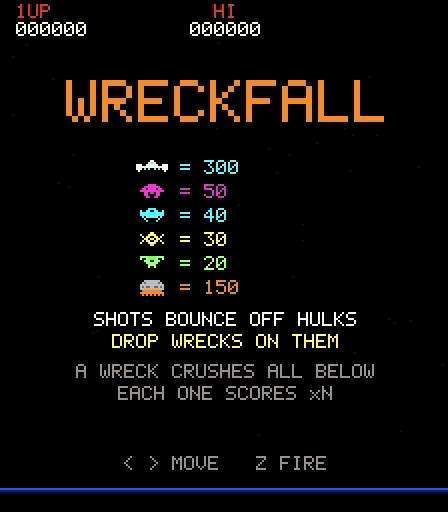

# WRECKFALL

A fixed-screen 1981-style shooter. Your cannon fires **straight up**, one shot at a time, into five
lanes of craft crossing the sky. A craft you hit does not vanish: it becomes a burning **wreck**
that falls, crushing every craft it passes through on the way down. Then it lands where you are.
The bottom lane is **armoured hulks**. Shots bounce off them, and only a wreck dropped from above
can break one.

[Play in the browser](https://abagames.github.io/agentic-gamedev-games/wreckfall/) ·
[gameplay video with sound](media/wreckfall-play.mp4) (4 s title, then 16 s of wave 1 played by the
oracle bot)



## Tags

None. The user's brief (1980s fixed-screen arcade shooter, fire direction up only) was specific
enough, so no tags were drawn (AGENTS.md: draw tags only for open-ended briefs).

## The envisioned full game

- An arcade cabinet with a **12-wave campaign** (see Campaign) that ends in ALL CLEAR: lane
  formations descend on the city line, varied by craft whose **wrecks behave differently**, by
  armour, and by how the lanes move.
- Every variation must change how a wave plays out. HEAVY, a challenge stage and PULSE were tried
  and removed because they did not (see Deliberately omitted).
- A full release could add a second, harder loop after ALL CLEAR and 2-player alternation.
- The fixed rule is *every kill becomes a falling hazard that is also your best weapon*.
- This build is the whole campaign, with lives, extends, a ships bonus at the end and a high
  score.

## Campaign

12 waves in 4 acts. Each wave adds **at most one element not seen before** (checked by a test),
and the last wave combines everything. Clearing wave 12 pays a **ships bonus** of 10,000 per
ship left, then shows ALL CLEAR. The HUD shows the wave as "n/12".

| wave | name / behaviour | hulk lanes × hulks | thick | splitters | escorts per lane | mothership every | time allowance | new element |
|---|---|---|---|---|---|---|---|---|
| 1 | plain | 1×3 | – | – | 4 | 20 s | 39 s | the core |
| 2 | plain | 1×3 | – | yes | 4 | 20 s | 37 s | SPLITTER |
| 3 | plain | 1×4 | 1 | – | 5 | 20 s | 50 s | THICK hulk |
| 4 | **TWIN LINE** | 2×3 | – | – | 5 | 20 s | 54 s | two hulk lanes |
| 5 | CONVOY | 2×4 | 1 | yes | 5 | 20 s | 79 s | CONVOY |
| 6 | REVERSE | 2×4 | 1 | – | 5 | 20 s | 65 s | REVERSE |
| 7 | CONVOY | 2×4 | 2 | – | 6 | 18 s | 79 s | – |
| 8 | REVERSE | 2×5 | 2 | yes | 6 | 18 s | 70 s | – |
| 9 | plain | 2×5 | 2 | yes | 6 | 16 s | 65 s | – |
| 10 | CONVOY | 2×5 | 3 | yes | 6 | 16 s | 76 s | – |
| 11 | REVERSE | 2×5 | 3 | – | 6 | 16 s | 66 s | – |
| 12 | **LAST STAND** | 2×5 | 4 | yes | 6 | 10 s | 73 s | everything; the mothership is the tool for four thick hulks |

- **Why 12:** the element set is complete by wave 6, and density reaches its cap (6 escorts,
  5 hulks per lane) by wave 8. Pressure reaches its floor by wave 10. In the earlier endless
  build, waves after that differed only in speed, descent and bomb rate.
- **Why this order:** in the endless build, wave 4 introduced two hulk lanes, CONVOY, splitters
  and a thick hulk at once. The campaign introduces two hulk lanes alone (TWIN LINE) before either
  behaviour.
- **Length:** a strong run takes about 4 minutes (oracle) to 8 minutes (the one human-limited
  all-clear).

## Controls

- **← → / A D**: move the cannon.
- **Z / Space / X / ↑**: fire. One shot on screen. Holding fire does not repeat, so each shot is a
  deliberate press.
- **Space / Enter**: start.
- **Touch**: drag anywhere to slide the cannon (relative). Tap, or tap with a second finger, to fire.
- **M**: mute.

## Core interaction and main decision

*Intended sensation:* thread one shot up through the crossing traffic, then slide clear as the
wreck you made tears down through every lane that has drifted beneath it and slams into a hulk.

Rules:
- A shot hits the **lowest** thing in its column: a craft, a bomb, a falling wreck (which absorbs
  it), or a hulk (it clinks off). To reach a high craft you must fire through a gap that is still
  open when the shot gets there.
- A hit craft pops up and falls with gravity. It keeps **half its lane's sideways speed**, so
  wrecks drift downstream.
- Each craft the wreck falls through is swallowed. The k-th scores k × its value, the wreck grows
  5 px wider, and its drift averages in that craft's motion.
- A wreck that reaches the ground kills the cannon if it lands on it. A red bracket on the ground
  shows its predicted landing span and blinks in the last 0.4 s.
- **Hulks** (grey, orange belly plate, 150 pts) are the wave objective. The wave clears when every
  hulk is crushed.
- **Height bonus:** a wave pays px of room left above the line × 40 × (wave + 1). The bonus still
  on offer is shown on the right end of the invasion line and drains as the formation comes down.
- Escorts you destroy **re-enter from their lane's edge** 2.4 s later, so there is always
  something to drop.
- Bombs are telegraphed: the craft blinks red for 0.4 s before releasing. They fall straight, and
  a shot destroys them.
- **The formation descends steadily**, at a speed set by the wave's **time allowance**:
  - allowance = (24 s + 5 s per hulk + 12 s per thick hulk + 10 s with two hulk lanes) ×
    pressure × 1.15 on CONVOY waves, where pressure is 1 − 0.05 per wave, down to 0.55;
  - descent = room above the line ÷ allowance;
  - more work means more time (see the Campaign table), and pressure makes each target slightly
    cheaper in time.
- **If a hulk reaches the dotted line the game is over at once**, whatever lives are left. Lives
  only cover bombs and wrecks.
- **Formation behaviour** (see the Campaign table):
  - **CONVOY:** every lane streams the same way, so vertical alignments are rare and slow to come.
  - **REVERSE:** each crushed hulk flips the direction of the lane above it, so every success
    rearranges the board. Arrows flash at both ends of the flipped lane.

  The READY screen names the wave and its behaviour.

### Special craft: SPLITTER

- **Schedule:** the waves marked in the Campaign table.
- **Placement:** in a splitter wave, one craft in each escort lane is a splitter. It keeps its
  lane's colour and points but has its own silhouette (two pods on a spine). A destroyed splitter
  re-enters as a splitter. The READY screen shows the splitter icon on those waves.
- **Behaviour:** a splitter's wreck **forks into two** that spread at ±34 px/s. A chain that
  swallows one forks too, and both branches keep the chain count.
- **Trade-off:** one shot can reach two hulks, but it leaves two landing zones to avoid.

The main decision is **what to shoot, and when**. The best shot is usually not the nearest craft.
It is an upper craft whose wreck will meet a hulk: lower lanes will slide under its fall path, and
a hulk will be passing beneath when it arrives. Against this sits the cost:
- every kill drops a wreck back into your own column;
- a big chain is wide and drifts;
- bombs, the descending line (game over) and the draining height bonus limit how long you can
  wait.

A second situation pulls the other way: when the hulks are near the line, you take any wreck that
can reach one now. On splitter waves, a splitter is often the best direct target, and a
chain routed through one covers two hulks.

Why simple play loses (measured, see Validation):
- **Idle:** bombs, then invasion.
- **Mashing in place:** your own wrecks land on you, 18 of 18 deaths.
- **Greedy nearest shot:** it progresses, but it cannot beat hulks efficiently. With perfect
  dodging it clears 5 waves against the oracle's 52. Under human limits it stalls at wave 4, against
  about wave 5–6 for chain-reading play.
- **Farming** (holding the last hulk back and scoring respawning escorts until the line is close)
  scores less per wave than clearing promptly, because the drained height bonus outweighs the
  escort points.

### Thick hulks

- **Count:** from wave 3, part of the bottom hulk lane is **thick**, per the Campaign table (1 → 4).
- **Look:** fully orange-plated with dark rivets, where a plain hulk is grey.
- **Rule** by the size of the wreck that lands on it:
  - a single craft (×1) **breaks up** on it, and nothing happens;
  - ×2 breaks up too but **knocks the plate off** ("CRACK"), and the hulk turns grey (plain);
  - ×3 or more crushes it outright.
- The READY screen shows "×3 TO CRUSH" with the orange icon, and the hulk icons at bottom right
  show thick ones in orange.

### Mothership

- **Crossing:** the mothership crosses above the top lane at 46 px/s, first about 9 s into a wave,
  then every 14–26 s. It plays a warble while it is on screen.
- **Hit:** 300 points. A shot must thread every lane to reach it.
- **Its wreck:** 56 px wide, and it keeps that width (the normal wrecks' 36 px cap does not
  apply). It **counts as 3 craft**, so the first craft it swallows is the ×4 link, and it crushes
  thick hulks outright.
- **Cost:** its landing zone is very wide.

## Design and interaction language

- Portrait 224×256 raster, as on a vertical cabinet, black sky, integer-scaled pixels,
  scanlines. Everything is code-drawn with a 5×7 bitmap font.
- **Colour separates roles:**
  - each escort lane has its own hue: magenta 50, cyan 40, yellow 30, green 20;
  - hulks are the only grey with orange plates;
  - splitters keep their lane colour (it carries the points) and differ only in silhouette;
  - thick hulks are orange all over, and knocking the plate off turns them grey, a state change
    you can see;
  - the mothership is white with cyan windows; its wreck tumbles as two burning halves;
  - the cannon is green, and its barrel turns dark while a shot is in flight (reload readout);
  - everything that can kill you is red: bombs, the telegraph blink, the landing bracket, and the
    invasion line (it flashes as hulks close in).
- **Wrecks** are the hit craft, recoloured to burning red and tumbling in 45° steps like hardware
  sprite flips. They trail embers whose colour heats from red to white with chain length.
- **Feedback scales with the event:**
  - fire: a short blip;
  - clink on a hulk: a high metallic ping;
  - swallow: a pentatonic step up per link, with a "×n" beside the wreck;
  - landing: a thud that grows with n, plus the wreck's total;
  - fork: a two-tone split blip panned apart and a white spark; the branches keep the tumbling
    pieces;
  - **hulk crush**, the strongest: a boom, a small hit-stop, screen shake and a faint flash;
  - death: shake and noise.
- **March:** a four-note bass step, as in Space Invaders, speeds up as hulks fall and turns urgent
  near the line.
- The attract loop is a title card with the score table and the one rule you cannot guess
  ("SHOTS BOUNCE OFF HULKS / DROP WRECKS ON THEM"), then a demo played by the human-limited bot.

## What the slice is intended to validate

1. That a kill-becomes-falling-wreck rule turns a vertical shooter's "shoot the nearest" into
   reading lanes and timing a shot, and that this reading is needed for progress, not just a
   score bonus.
2. That the self-made wreck makes the move after every shot a real decision without making
   deaths feel arbitrary. The landing is predicted on screen.
3. That the loop is readable at arcade speed with one button.

## Structural tuning performed

- **v1 (no armour):** the greedy-perfect bot reached the **same wave (12)** as the chain-seeking
  oracle. Chains were only a score bonus. → Added the **armoured hulk lane**: shots clink off, and
  only wrecks crush hulks.
- **v2:** a **deadlock**. Once the upper lanes were cleared nothing was left to drop, and every
  policy died of invasion (oracle median wave 0). → **Escorts re-enter** from their lane edge 2.4 s
  after dying, the wave objective became "crush all hulks", and hulk lanes were made slow (17 px/s)
  so they are readable targets.
- **Wave ramp:** the human-limited bot hit a cliff at wave 7 (2 of 9 cleared), because descent,
  start height and a doubled hulk count stacked. Descent then grew 0.10 px/s per wave (was 0.18; later replaced, see Farming exploit),
  start height is capped lower, and hulks per lane grow every 3 waves.
- **Extends** moved to 20 000, then every 60 000, because chain scoring inflated lives. They
  moved again to 30 000, then every 100 000, once the larger height bonus inflated scores. For the
  12-wave campaign the second extend was brought forward to 100 000 (then 200 000, 300 000, …).
- **Time allowance** (raised in review: "time should grow with the number of targets"):
  - Descent used to be a fixed speed per wave. Time to invasion therefore *shrank* as targets grew:
    52 s for 3 hulks on wave 1, 39 s for 3 + a thick on wave 3, 34 s for 8 on wave 4, 30 s for
    8 + a thick on wave 5. This caused walls at waves 3 and 5.
  - Descent is now derived from a per-wave allowance (see Rules).
  - Human-limited clears per wave went from 12/12/9/7/0 to 12/12/11/11/11/10 for waves 1–6, and it
    now reaches about wave 7–8 instead of 5.
- **Formation behaviours** (`npm run behaviors`, wave 5, 10 seeds per bot, same seeds):
  - **CONVOY** made alignments rare: human-limited clears 10/10 → 7/10 and 3.0 → 4.4 shots per
    hulk; human-greedy clears 9/10 → 5/10.
  - **REVERSE** (8 flips per wave) made new alignments keep appearing: the human-limited bot
    cleared faster (46 s → 29 s, 3.0 → 2.1 shots per hulk). The human model pays 0.6 s to re-read
    after each flip.
  - **PULSE** (lanes stop and start) was **removed**. Even with holds longer than a wreck's fall
    (1.8 s), no bot fired more during holds than their share of time (57% of shots in 60% of
    time). It only made alignments rarer, which CONVOY already does, so it added no new decision.
- **Farming exploit** (raised in review; `npm run farm`):
  - Escorts respawn forever, so holding back the last hulk and scoring escorts until the line was
    close earned more per wave than clearing (oracle-level farming bot: wave 2 7 973 vs 3 685,
    wave 5 10 570 vs 8 565).
  - An invasion also only cost a life.
  - Chosen fix, which keeps points for escort kills:
    - **invasion is an immediate game over**;
    - **the descent is faster** (was 0.9 px/s +0.1 per wave);
    - **the height bonus is much larger** (was room × 10 × wave; now room × 40 × (wave + 1)).
  - The bonus lost per second of waiting is now larger than farming earns per second.
  - Result, prompt clear vs farming: wave 1 7 543 vs 6 920, wave 2 8 560 vs 6 663, wave 5 15 143
    vs 9 585.
  - A first try with a flat 2.0 px/s descent ended a quarter of human-limited games by invasion
    on wave 1. The descent now starts at 1.5 and ramps.
- **Input:** a key tap shorter than one 60 Hz tick was dropped, found by the browser probe. Fire
  presses are now latched until the next tick.
- **Challenge stage:** added, then removed after play review (see Deliberately omitted).
- **Special craft:**
  - HEAVY and SPLITTER were added. HEAVY needed a ground shockwave to change the bots' choices at
    all, and a fix so the shockwave did not grow with the chain.
  - In play review HEAVY **did not change how a wave plays out**, and it was removed. A wreck only
    drifts at half its lane speed, so straight vs drifting moved the landing by roughly 12–20 px,
    which is not visible in play. The shockwave mattered only when a heavy was shot directly
    overhead, and walking away was enough.
  - SPLITTER remains, on alternate waves.

- **Thick hulks** (`npm run extras -- 10 5 thick`):
  - **First version (every small wreck just bounced, one per hulk lane):** perfect-dodging greedy
    clears at wave 5 fell from 8/10 to 1/10, but the human-limited bot also fell from 5/10 to 2/10.
    With game-over invasion, one uncrushable hulk ends the run.
  - **Plate knock-off:** greedy play was no longer affected. The human-limited bot still suffered,
    partly a bot artifact: its planner gave a plate knock no value. Plate knocks were then counted
    as progress for all planners.
  - **Final rule:** ×1 does nothing, ×2 cracks, ×3 crushes, and thick hulks are counted per wave in
    the bottom lane only.
  - Inside wave 5 the effect is now small (0.5–0.6 bounces per wave for non-oracle bots). Over whole
    games, human-greedy stops at wave 3–4 while human-limited reaches about 5.
- **Mothership:**
  - At 30 px wide its wreck crushed 1 hulk in 30 at wave 3, with no effect on clear time.
  - Widened to 56 px and exempted from the width cap. Over whole games, the oracle hits 64% of
    crossings (59/92): each wreck averages an 8.4-craft chain and 2,600 points, crushes 1.2 hulks,
    and makes 20% of its chain points.
  - The human-limited bot hits 11% (4/37), but each hit is equally big (7.3-craft chain).

## Play-feel tuning performed

- Hulk crush got a 35–95 ms hit-stop (longer for longer chains), shake, a flash capped at 22%
  opacity, and the low boom. It is the only event with hit-stop.
- Chain popups showed full "×n pts" text on the wreck and stacked unreadably. Now each link shows
  only "×n" beside the wreck, the total appears at the landing (n ≥ 2), and hulks show their
  points.
- A reload readout on the barrel replaced an invisible "loaded" pixel.
- The wreck gets a small upward pop (anticipation) before falling, and embers mark live wrecks.
- Stars were made static (the twinkle had no gameplay meaning). DEMO text was moved off the
  banner line.


**Second play-feel pass** (review request; `maximizing-game-feel` checklist). The weakest moments
were the player's own actions after firing: the shot and the dodge had almost no response.
Everything below is render or sound only; rules and hitboxes are unchanged.

1. **Firing:** a muzzle flash at the barrel, and the cannon kicks down 2 px and eases back.
2. **Near miss:** a wreck landing, or a bomb passing, within 6 px of the kill reach (`graze` in
   the core) gives a side-spark streak and a soft whoosh. It is visibly weaker than any hit and
   occurs about 3.4 times a minute in human-limited play.
3. **Death reads as cause and effect:** half a second of slow motion (0.3×), with the screen flash
   kept low. A blinking red outline around the killer was also tried, and removed in review as
   unnecessary.
4. **Cannon lean:** the sprite shears slightly into its motion and settles when it stops.
5. **Falling whistle:** the biggest falling wreck (3+ craft) whistles, rising as it nears the
   ground, so a big landing can be dodged by ear.
6. **March step:** the formation steps down 1 px on each march beat (render only), so the slow
   descent reads as marching.
7. **Near the line:** within 40 px of the line, a red tint appears at the screen edges, pulsing on
   the march beat, and a low heartbeat joins the urgent march.
8. **Height bonus count-up:** on wave clear the bonus counts up with rising ticks. The score
   already rolls up in the HUD.
9. **Plate chunks:** a cracked thick hulk sheds 2×2 orange chunks that fall to the ground.
10. **Chain heat:** wrecks of 2+ craft get a two-layer flickering glow that grows with the chain.

Checks:
- in-page rendering holds 60 fps with a worst frame of 16.8 ms in demo play;
- the probe renders every enemy tint combination without errors;
- hulk crush remains the only event with hit-stop and the loudest sound.

## Campaign tuning performed

(`npm run campaign`, 12 seeded runs per bot)

- **First table:**
  - The oracle all-cleared only 6/12, losing lives to its own wrecks. Its planner stopped
    simulating when its wreck landed, so it now looks 0.6 s past each plan: a reference bot must
    dodge well too.
  - The human-limited bot hit steps at TWIN LINE (6/9 cleared) and at wave 7 (CONVOY + 2 thick,
    2/6).
  - → Two-lane waves got +10 s, and CONVOY waves ×1.15 time.
- **Final ladder:**

| policy | ALL CLEAR | median wave reached | notes |
|---|---|---|---|
| oracle (exact forward search) | 12/12, 3.6 min | – | about 0–4 wreck deaths per 12 runs per wave |
| oracle-greedy (perfect dodge, shoots anything) | 10/12, 6.0 min | – | skill-dependent: spamming only works with perfect execution |
| **human-limited, chain-seeking** | 1/12, 7.8 min | 7 | per-wave clears 11, 11, 9, 8, 7, 6, 5, 4, 3, 2, 2, 1: about one run lost per wave, no single wall |
| human-limited, greedy objective | 0/12 | 4 | |

- **Farming still loses** at waves 5, 8 and 12 (prompt clear vs farming: 19,593 vs 16,450;
  28,077 vs 18,312; and about 47k vs 19k on wave 12 once the harness's 99-life ships bonus is
  removed).
- **Fairness:** none of the human-limited bot's 13 wreck deaths was inescapable from 0.6 s before.

## Validation

`npm test` runs 25 rule invariants, all passing.

The campaign and ending (2):
- 12 waves, each adding at most one element not seen before;
- wave 12 pays the ships bonus and ends as ALL CLEAR.

Descent and behaviours (3):
- descent × time allowance = room, and more work gets more time;
- invasion is an immediate game over;
- REVERSE flips the lane above a crushed hulk (plain waves do not).

Thick hulks and the mothership (4):
- thick hulks follow the table, in the bottom lane;
- ×1 breaks up, ×2 cracks, ×3 crushes;
- the mothership crosses and leaves;
- its wreck is 56 px, counts as 3 craft and keeps its width.

The height bonus drains as the formation descends (1).

The 3 invariants for splitters are:
- splitters only on the campaign's splitter waves, one per escort lane;
- a splitter forks into two spreading wrecks, and a swallowed splitter forks the chain with its
  count;
- splitters re-enter as splitters.

The 12 core invariants are:
- determinism;
- a shot hits the lowest craft first;
- one shot, no auto-repeat;
- clink on hulks;
- chain scoring k × points and wreck growth;
- a wreck kills the cannon only on overlap;
- drift carries lane motion;
- escorts respawn from the correct edge, hulks never do;
- wave clear and height bonus;
- telegraphed bombs kill, and shots destroy them;
- wrecks absorb shots;
- extend thresholds and game over.

`npm run probe` drives the real page in Chromium through 10 steps, all passing with no page
errors:
- load and title;
- start and READY;
- keyboard movement both ways;
- a single shot with no auto-repeat;
- a hulk clink;
- a wreck dropped onto a hulk (chain 2) while the cannon escapes;
- touch drag and tap;
- a death on the last life, game over, back to the title;
- restart as a fresh game;
- the attract demo.

Policy ladder with everything: splitters, thick hulks, the mothership, formation behaviours,
time-allowance descent and game-over invasion (seeded, 6–12 games each). Each conclusion names
its policy.

| policy | median waves cleared | notes |
|---|---|---|
| idle | 0 | 18/18 deaths from bombs |
| mash in place | 0 | 18/18 deaths from its own wrecks |
| greedy, perfect dodge (oracle-greedy) | 24 (the 15-min cap) | perfect execution makes spamming viable with the longer allowances |
| human-limited, greedy objective | reaches about wave 4–5 | `npm run waves`, 12 seeds |
| **human-limited, chain-seeking** | **about 6–7** (reaches about wave 7–8; about 4.5 min) | the next step is wave 7 (CONVOY, 10 hulks, 2 thick): 5/10 cleared |
| oracle (exact forward search) | 42–44 (the 15-min cap) | superhuman scores; it still collects about 25 extends |

- **History:**
  - before splitters: human-limited reached wave 10, human-greedy wave 7, oracle-greedy cleared 22
    and the oracle 45;
  - with splitters and the old soft invasion: 8 vs 6–7 and 30 vs 49;
  - with game-over invasion, before thick hulks and the mothership: human-limited reached 5–6,
    human-greedy 4, oracle-greedy cleared 5 and the oracle 52;
  - with thick hulks and the mothership, before the time allowance: 5 vs 3–4, and 6 vs 25.
- **Farming** still loses: prompt clear vs farming was 9,803 vs 8,665 on wave 2 and 14,487 vs
  11,968 on wave 5. With the longer allowances the margin is narrow on the CONVOY wave 4 (15,970 vs
  14,600, with farming also costing a death per wave).
- **Fairness** (`npm run fairness`, current build): 1 of the human-limited bot's 14 wreck deaths
  was inescapable from 0.6 s before; 11 of the 14 happened with more than one wreck in the air
  (forks). Earlier, 8 of the oracle's 30 wreck deaths came from mothership wrecks.
- **Does the splitter change the decision?** (`npm run specials`): the same wave on the same
  seeds, with and without splitters. Shares below are shots aimed at splitters vs their share of
  escorts.

| | wave 2: oracle | wave 2: human-limited | wave 6: oracle | wave 6: human-limited | wave 6: human-greedy |
|---|---|---|---|---|---|
| splitter shot directly | 45% vs 23% | 31% vs 25% | 27% vs 16% | 22% vs 16% | 21% vs 17% |
| shots per hulk (none → splitter) | 1.22 → 1.22 | 3.33 → 2.75 | 0.72 → 0.64 | 2.56 → 1.80 | 3.61 → 4.06 |
| own-wreck deaths per wave (none → splitter) | 0 → 0.08 | 0.08 → 0.42 | 0 → 0.13 | 0 → 0.25 | 0.13 → 0.75 |

- **Are wreck deaths fair?** (`npm run fairness`): for each wreck death, the game is rewound
  0.6 s and every reachable position is tried.
  - Human-limited: 1 of 11 wreck deaths could not be escaped. 5 of the 11 happened with more than
    one wreck in the air.
  - The first splitter wave (wave 2) raises the human-limited bot's own-wreck deaths from 0.08 to
    0.42 per wave.
- **Human-limited model:**
  - plans from a noisy read of each lane (σ 4 px);
  - considers only targets within 64 px;
  - settles for one of its top 3 options;
  - fires with σ 70 ms timing error;
  - notices new threats 0.28 s late, with 15% lapses of +0.45 s;
  - needs 0.35 s to settle between shots;
  - starts dodging 0.18 s after firing.
- **Sanity check** (`npm run botcheck`): the human-limited bot fires 37 shots/min with a median
  gap of 1.65 s. Its deaths split across bombs, invasion and its own wrecks.
- Its known optimism: its plan is an exact simulation of the noisy view, so it "knows" the physics
  better than a first-time player.

## Deliberately omitted

- **Challenge / bonus stage (tried and removed).** It was a fixed formation with random lane
  phases, no bombs or descent, and a shot budget. In the bots it separated reading from greedy
  play (human-limited 33% PERFECT, greedy 0%). In play review it felt too close to a normal wave
  with the pressure taken away, so it added little variety. Variation should come from changing
  what a wreck does (for example heavy, splitting or fluttering wrecks), not from removing
  hazards.
- **HEAVY (tried and removed):**
  - Its wreck ignored lane drift and fell straight and fast, a swallowed heavy stopped a chain's
    drift, and a later version added a ground shockwave.
  - The bots showed a shift in choice: the oracle avoided shooting heavies directly.
  - In play review it did not affect how a wave unfolds. The drift it removed was only about
    12–20 px of landing offset, and the shockwave was escaped by normal movement.
- 2-player alternation, mothership/UFO bonus, shields/bunkers, further wreck behaviours (flutter,
  bounce), initials entry, difficulty options.
- Bunkers were left out on purpose: they would give a safe spot to sit under and weaken the wreck
  cost.

## Run locally

Open `index.html` in a browser. No build step and no dependencies at runtime.
Tests use Node ≥ 18. The browser probe uses the repository's Playwright:

```sh
cd docs/wreckfall
npm test             # rule invariants
npm run probe        # real-page probe in headless Chromium
npm run ladder       # full policy ladder (slow: ~2 min)
npm run waves        # per-wave reach/clear/deaths for human-limited (chain vs greedy)
npm run botcheck     # simulated-player input-rate sanity check
npm run specials     # SPLITTER: shot preference, shots per hulk, deaths, per bot
npm run fairness     # were wreck deaths escapable 0.6 s / 1.0 s before? (with and without specials)
npm run farm         # exploit probe: holding back the last hulk vs clearing promptly, per wave
npm run extras       # thick hulks / mothership, each on vs off on the same waves and seeds
npm run behaviors    # CONVOY / REVERSE vs plain on the same wave and seeds
npm run campaign     # the 12-wave campaign: ALL CLEAR rate and per-wave clears per bot
npm run video        # re-record media/wreckfall-play.mp4 (sound) and screenshot.gif (needs ffmpeg)
```

## Known limits / untested

- **Hands-on play:** the game was played in review, and the feel was accepted. Several changes
  came from that play: HEAVY, the challenge stage and the killer outline were removed; sprites
  were redrawn; the volume was raised; an extend display bug was fixed. The campaign difficulty
  numbers are still bot-based, and a hands-on report on ALL CLEAR difficulty should override
  them.
- Whether first-time players read "shots bounce off hulks" from the title card and the clink
  alone has not been tested with people.
- Touch was exercised only through emulated CDP touch events, not on a physical device.
- Audio levels were raised after a report that the sound was nearly inaudible:
  - master level ×12.5 (0.32 → 4.0), into a tanh soft clipper;
  - a DynamicsCompressor was tried first and cut short blips to a quarter of their level.
  - Measured peaks through the real audio graph: shot 0.28, march 0.46, hit 0.61, hulk crush 0.94,
    death 0.88.
  - Balance by ear has not been checked beyond that.
- Whether REVERSE's lane flips feel readable or chaotic to a person is untested. The bot's 0.6 s
  re-read cost is a guess.
- Whether players read the orange thick hulk and the "×3 TO CRUSH" rule, and whether the
  mothership's hit rate feels fair, has not been tested with people.
- Whether players read the splitter silhouette at speed has not been tested with people. A fork
  from a low-lane splitter gives little warning, and the fairness check covers it only from the
  bots' side.
- Whether 12 waves is the right length for people, and whether ALL CLEAR is too reachable for
  strong human players, is untested. The bots say the oracle clears every time, and the
  human-limited bot clears 1 in 12.
